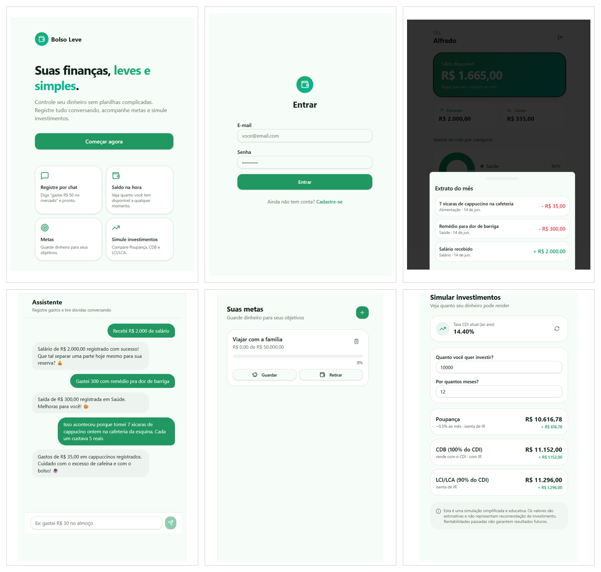

# 💸 App de Organização de Finanças Pessoais com Vibe Coding


# Prompt final / PRD usado com a IA:

```markdown

# Contexto

Quero criar um aplicativo de Organização de Finanças Pessoais que funcione de forma simples, com login e senha para o usuário entrar.
A ideia é facilitar o controle financeiro sem planilhas complexas, com saldo, entradas, saídas, metas, gráficos simples, agente de IA e simulação básica de investimentos.
O app não deve ser um banco real. Não precisa conectar conta bancária, Pix, cartão, extrato bancário real ou conta digital.

# Problema

Muitas pessoas desistem de controlar o dinheiro porque os aplicativos atuais parecem complicados.
Quero resolver isso com um app mais simples, onde a pessoa consiga registrar entradas e saídas, ver seu saldo, acompanhar metas, ver gráficos do mês e simular investimentos básicos.

# Público-Alvo

Pessoas que querem começar a organizar suas finanças de forma prática e sem complicação, principalmente iniciantes.

# Página principal

A página principal deve mostrar o saldo disponível do usuário.
O chat deve registrar entradas e saídas de dinheiro, aumentando ou diminuindo esse saldo.
Ao clicar no saldo, o usuário deve ver um extrato simples do mês com entradas usando + e saídas usando -.

# Funcionalidades-Chave

1. Criar login e cadastro com e-mail e senha.
2. Registrar entradas e saídas de dinheiro via chat em linguagem natural.
3. Classificar automaticamente as transações em categorias simples.
4. Mostrar o saldo disponível na página principal.
5. Mostrar um extrato simples do mês ao clicar no saldo.
6. Criar metas financeiras.
7. As metas devem permitir guardar ou retirar dinheiro, alterando também o saldo disponível.
8. Mostrar gráficos simples do mês, com porcentagem de gastos por categoria.
9. Criar um agente financeiro com IA, usando os dados do usuário para dar dicas simples de economia e organização.
10. Criar uma calculadora simples de investimentos, comparando Poupança, CDB e LCI/LCA.
11. Na calculadora, o usuário deve informar valor, prazo e porcentagem do CDI para CDB e LCI/LCA.
12. O app deve buscar automaticamente a taxa DI/CDI mais recente em uma fonte pública.
13. Se a busca da taxa DI/CDI falhar, permitir preencher a taxa manualmente.
14. Para CDB, considerar desconto de Imposto de Renda conforme o prazo.
15. Para LCI/LCA, considerar que não tem Imposto de Renda para pessoa física.
16. Para Poupança, usar uma regra simples de rendimento no Brasil.
17. No final da simulação, mostrar qual opção teve o melhor resultado estimado.
18. Deixar claro que a simulação é apenas informativa e não é recomendação de investimento.

# Exemplos de uso no chat

Recebi R$ 2.000 de salário.
Gastei R$ 50 no mercado.
Guardei R$ 200 na meta Viagem.
Retirei R$ 100 da meta Viagem.
Quanto eu posso economizar este mês?
Simular R$ 1.000 por 12 meses.

# Estilo do aplicativo

Quero um visual simples, moderno e fácil de usar.
O app deve ter cards, botões claros, gráficos simples e boa visualização no celular.
A linguagem deve ser fácil de entender, pensando em pessoas que estão começando a cuidar melhor do dinheiro.
Priorizar que o aplicativo funcione bem, sem criar recursos avançados além do que foi pedido.

# Entregável da IA

Criar uma primeira versão funcional do aplicativo no Lovable, com login, saldo principal, extrato do mês, registro por chat, metas financeiras, gráficos mensais, agente financeiro com IA e calculadora simples de investimentos com busca automática da taxa DI/CDI.
Priorizar que as funções principais funcionem sem erro.

```


# Interações com o Lovable:

- "Quero criar um aplicativo de Organização de Finanças": {PRD}

- "Correção de erros": o app não apresentava as páginas de metas e simulação de investimentos, e não era possível criar conta sem usar o login com Google.

- "Pagina de metas e de investir nao funcionam, ambas relatam "404 - pagina nao encontrada". Nao é possivel cadastrar nenhuma conta a nao ser pelo google. Pagina de login nao tem necessidade de ter tantas informaçoes, apenas o login e criar conta, inclusive o link com o google é desnecessário. O aplicativo esta instavel e demorando": Ajuste nas páginas de metas e investimentos, que retornavam erro 404. Também foi simplificada a tela de login, removendo o acesso com Google e mantendo apenas e-mail e senha.


# Resultado final do Lovable:

https://bolso-descomplicado.lovable.app/


# Prints do aplicativo

Abaixo estão algumas telas do aplicativo gerado no Lovable. Durante o processo, também foram feitas interações com IA para criar, corrigir e refinar o projeto.

<p align="center">
  
</p>


# Resumo das funcionalidades do app

O **Bolso Leve** é um aplicativo de organização de finanças pessoais criado para ajudar pessoas iniciantes a controlarem melhor o próprio dinheiro de forma simples.

### Objetivo principal

* Ajudar o usuário a organizar entradas e saídas de dinheiro.
* Mostrar o saldo disponível de forma clara.
* Facilitar o acompanhamento de gastos, metas e investimentos básicos.
* Evitar o uso de planilhas complexas ou formulários difíceis.
* Criar uma experiência mais natural, usando conversa com um assistente.

### Login e acesso

* O app possui tela inicial de apresentação.
* O usuário pode criar uma conta.
* O usuário pode entrar usando e-mail e senha.
* Cada usuário acessa suas próprias informações financeiras.

### Página principal

* A página principal mostra o saldo disponível do usuário.
* O saldo aparece como a informação mais importante da tela.
* A tela também mostra:

  * total de entradas;
  * total de saídas;
  * gastos do mês por categoria;
  * acesso rápido ao assistente;
  * acesso às metas financeiras.

### Saldo e extrato

* O saldo é atualizado conforme o usuário registra entradas e saídas.
* Entradas de dinheiro aumentam o saldo.
* Saídas de dinheiro diminuem o saldo.
* Ao clicar no saldo, o usuário vê um extrato simples do mês.
* O extrato mostra as movimentações com valores positivos e negativos.
* Exemplos:

  * `+ R$ 2.000,00` para salário recebido;
  * `- R$ 50,00` para gasto no mercado;
  * `- R$ 300,00` para compra de remédio.

### Assistente financeiro

* O app possui um assistente em formato de chat.
* O usuário pode registrar movimentações escrevendo frases simples.
* Exemplos de frases:

  * “Recebi R$ 2.000 de salário”
  * “Gastei R$ 50 no mercado”
  * “Gastei R$ 300 com remédio”
  * “Guardei R$ 200 na meta Viagem”
* O assistente interpreta a mensagem e registra a movimentação.
* O assistente também pode responder com dicas simples de economia e organização financeira.

### Registro de entradas e saídas

* O app permite registrar dinheiro que entra.
* O app permite registrar dinheiro que sai.
* As entradas representam recebimentos, como salário ou renda extra.
* As saídas representam gastos, como mercado, saúde, transporte ou contas.
* As movimentações são organizadas em categorias simples.

### Categorias

* As transações podem ser classificadas em categorias.
* Algumas categorias usadas no app são:

  * alimentação;
  * saúde;
  * salário;
  * mercado;
  * metas;
  * outros.
* As categorias ajudam a montar os gráficos e o resumo mensal.

### Gráficos do mês

* O app mostra gráficos simples dos gastos do mês.
* O gráfico principal mostra a porcentagem de gastos por categoria.
* Isso ajuda o usuário a entender onde está gastando mais.
* A visualização é simples, pensada para iniciantes.

### Metas financeiras

* O usuário pode criar metas financeiras.
* Exemplo de meta:

  * “Viajar com a família”
  * “Reserva de emergência”
  * “Comprar um celular”
* Cada meta mostra:

  * nome da meta;
  * valor desejado;
  * valor já guardado;
  * progresso em porcentagem.
* O usuário pode guardar dinheiro em uma meta.
* O usuário pode retirar dinheiro de uma meta.
* A ideia é acompanhar objetivos financeiros de forma simples.

### Simulador de investimentos

* O app possui uma área para simular investimentos básicos.
* O usuário pode informar:

  * valor que deseja investir;
  * prazo em meses.
* O simulador compara opções como:

  * Poupança;
  * CDB;
  * LCI/LCA.
* O app mostra uma estimativa de rendimento para cada opção.
* O simulador usa a taxa CDI como referência.
* A taxa CDI aparece automaticamente na tela.
* O resultado mostra:

  * valor final estimado;
  * rendimento estimado;
  * comparação entre as opções.
* O app deixa claro que a simulação é educativa e não representa recomendação de investimento.

### O que o app não é

* O app não é um banco real.
* O app não conecta com conta bancária.
* O app não possui Pix.
* O app não possui cartão.
* O app não puxa extrato bancário real.
* O app não substitui uma consultoria financeira profissional.

### Proposta do projeto

* O projeto foi criado como uma primeira versão funcional.
* O foco foi praticar Vibe Coding usando ferramentas de IA.
* A ideia principal foi transformar um prompt em um aplicativo real usando o Lovable.
* O app funciona como um MVP, ou seja, uma versão inicial para testar a ideia.
* Mesmo não sendo um app completo, ele já mostra as principais funções pensadas no conceito inicial.


# Reflexão


### O que funcionou bem?

O que funcionou melhor foi perceber que o Lovable conseguiu transformar uma ideia escrita em uma primeira versão visual e funcional do aplicativo. 

A ferramenta criou telas importantes, como login, página principal, saldo, assistente financeiro, metas e simulador de investimentos. 

Mesmo sendo uma versão inicial, o app conseguiu representar bem a proposta do projeto, que era facilitar a organização financeira de forma simples para pessoas iniciantes. 

A parte visual também ficou boa, com uma aparência limpa e fácil de entender.


### O que não funcionou como o esperado?

Algumas coisas não saíram exatamente como eu imaginava na primeira tentativa. Em um momento, o aplicativo entendeu mais a ideia de registrar gastos do que a ideia de controlar um saldo completo, com dinheiro entrando e saindo. 

Também senti falta de mais opções nos gráficos e de mais controle sobre as porcentagens usadas no simulador de CDB, LCI e LCA. 

Além disso, percebi que pedir muitas funções ao mesmo tempo pode deixar o processo mais difícil, principalmente usando uma conta gratuita com limite de créditos, foi necessário então refinar o prompt e tentar de novo em uma nova conta no Lovable devido a limitação de tokens do aplicativo. 

Em dado momento, quando já definido o prompt final, o aplicativo resultou em alguns erros, que por uma primeira interação no aplicativo, causou certa apreensão devido também a limitação da utilização gratuita. 

Corrigidos os erros, o processo andou bem e foi finalizado. Depois de 3 tentativas (3 contas diferentes), entre o app não ficar simples demais e não estourar o limite do aplicativo, chegamos ao resultado apresentado.

### O que aprendi sobre conversar com IAs?

Aprendi que conversar com uma IA exige clareza. Algumas ideias que parecem óbvias para mim precisam ser explicadas com mais cuidado no prompt. 

Por exemplo, usar apenas a palavra “gastos” pode fazer a IA focar só em despesas, enquanto explicar “entradas, saídas e saldo” muda bastante o resultado. 

Também aprendi que Vibe Coding não é só pedir para a IA criar um app pronto. É um processo de testar, corrigir, melhorar o prompt e entender como guiar a ferramenta para chegar mais perto da ideia inicial.


